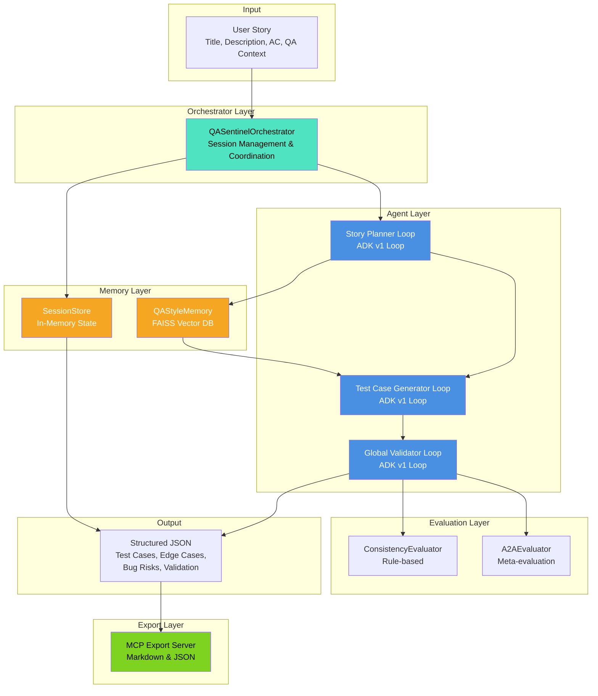
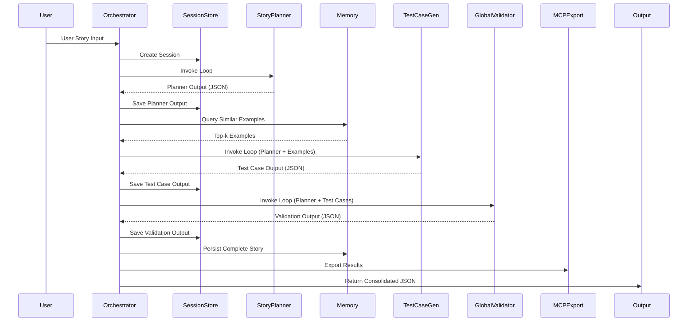
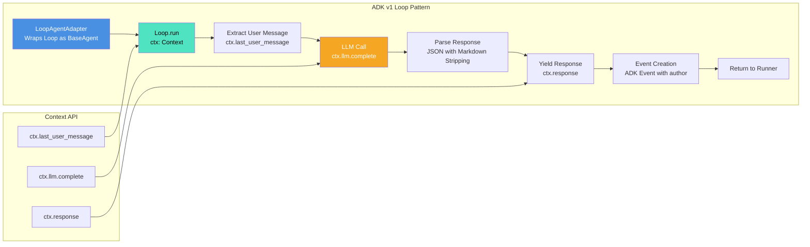
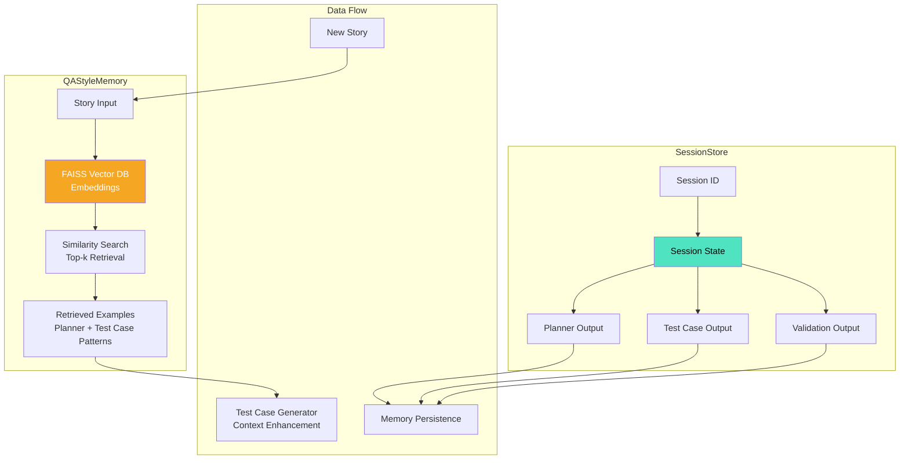

# 🛡️ QA Sentinel — Multi-Agent QA Pipeline

**Google ADK + Gemini + MCP**

A fully automated multi-agent QA system that transforms a user story into:

✅ Structured features  
✅ Complete test scenarios  
✅ High-quality manual test cases  
✅ Validation feedback  

— all orchestrated end-to-end using Google Agent Development Kit (ADK), Gemini models, LoopAgent validation, and MCP export tools.

**Built for Kaggle Agents Intensive (Capstone Project)**

Architected for clarity, robustness, reproducibility, and real-world QA workflows.

---

## 🚀 Overview

QA Sentinel is a production-grade agentic system designed to automate the entire QA planning workflow used in software development:

- **Planner Agent**: Breaks the story into features, scenarios, and acceptance-criteria mappings.
- **Test Case Generator Agent**: Generates Given/When/Then style manual test cases, edge cases, and bug risks.
- **Global Validator Agent**: Evaluates overall quality, alignment, structure, and consistency.
- **Orchestrator**: Manages pipeline execution, handles state, validates all ADK loop events, and ensures fully deterministic output.
- **Memory Layer (FAISS + JSON store)**: Retrieves similar past stories to improve future test-case generation.
- **Export Layer (MCP Server)**: Saves Markdown and JSON files from inside the ADK runtime to `/exports/...`.

This system mirrors how a real QA team works — but fully automated.

---

## 🧩 System Architecture

### High-Level System Architecture



### Orchestrator Flow



### LoopAgent Control Flow



### Memory Layer



### Evaluation Layer

```mermaid
graph TB
    subgraph "Pipeline Output"
        A[Planner Output] --> C[ConsistencyEvaluator]
        B[Test Case Output] --> C
        A --> D[A2AEvaluator]
        B --> D
    end
    
    subgraph "ConsistencyEvaluator"
        C --> E[Coverage Check<br/>All ACs Covered?]
        C --> F[Step Quality<br/>Given/When/Then Valid?]
        C --> G[Result Specificity<br/>Testable Outcomes?]
        E --> H[Rule-based Score]
        F --> H
        G --> H
    end
    
    subgraph "A2AEvaluator"
        D --> I[Cross-Agent Alignment<br/>Planner ↔ Test Cases]
        D --> J[Validation Accuracy<br/>Validator Correctness]
        I --> K[Meta-evaluation Score]
        J --> K
    end
    
    H --> L[Final Validation Result]
    K --> L
    L --> M[valid: true/false<br/>errors: []<br/>warnings: []]
    
    style C fill:#4A90E2,color:#fff
    style D fill:#4A90E2,color:#fff
    style L fill:#50E3C2,color:#000
```

At a high level, the system consists of:

- **ADK Loop Agents** - Three specialized agents using Google ADK v1 Loop pattern
- **Gemini models** - For all LLM tasks (Gemini 2.0 Flash)
- **Custom Orchestrator** - Manages pipeline execution and state
- **Consistency & A2A Evaluators** - Deterministic quality assessment
- **MCP File Export Server** - Model Context Protocol integration
- **Vector-based Memory Layer** - FAISS for pattern learning

Everything is modular, reusable, and extendable.

---

## 🛠️ Components

### 1. Story Planner (LoopAgent)

Breaks the story into:
- **Features**: 3-8 high-level feature categories
- **Structured scenarios**: Auto-incremented (SC-1, SC-2...)
- **Acceptance criteria mapping**: Ensures every AC is mapped to scenarios
- **Notes/insights**: Domain considerations for QA

**Validation ensures:**
- ✅ Every AC is mapped
- ✅ Features list is non-empty
- ✅ JSON structure is strict

**Implementation**: ADK v1 Loop pattern using `ctx.llm.complete()` with Gemini 2.0 Flash. Includes automatic JSON parsing with markdown code block stripping.

### 2. Test Case Generator (LoopAgent)

Generates for each scenario:
- **1-3 high-quality test cases** with:
  - Preconditions
  - Given/When/Then steps
  - Expected result
- **Edge cases**: Boundary condition scenarios (EC-1, EC-2...)
- **Bug risks**: Potential failure modes and security concerns (BR-1, BR-2...)

**Validation ensures:**
- ✅ Tests reference scenarios
- ✅ Each test case includes Given + When + Then
- ✅ Expected result exists
- ✅ All scenarios are covered

**Implementation**: Hybrid QA format with Gherkin-style steps. Uses memory-retrieved examples to maintain style consistency.

### 3. Global Validator Agent

Checks:
- ✅ Cross-agent consistency
- ✅ Missing scenarios
- ✅ Missing test cases
- ✅ Logical alignment
- ✅ JSON shape correctness

**Validation Rules:**
1. Coverage Completeness: Every scenario maps to ≥1 test case
2. Step Quality: All test cases have clear Given/When/Then steps
3. Expected Result Quality: Results are specific and testable
4. Duplicate Detection: No redundant test cases
5. Edge Case Alignment: Edge cases are meaningful and related
6. Consistency: Titles, IDs, and flows match across agents
7. QA Context Alignment: Test cases reflect QA preferences

### 4. Orchestrator

The orchestrator:
- ✅ Sends ADK messages to each agent
- ✅ Handles retries, validation, and state delta
- ✅ Extracts JSON safely from LoopAgent events
- ✅ Generates outputs with timestamps
- ✅ Logs everything using the observability layer

It guarantees the pipeline never produces broken output.

---

## 🧠 Memory Layer (FAISS)

The Memory Layer stores:
- Story title
- Acceptance criteria
- Planner output
- Testcase output

**Uses:**
- FAISS vector search
- Title embeddings
- Top-K retrieval for similarity

Used by TestCaseGenerator to write smarter, more consistent test cases.

---

## 📝 Evaluation Layer (Deterministic)

Two evaluators:

### ✔️ ConsistencyEvaluator

**Scores:**
- Scenario coverage
- GWT (Given/When/Then) structure
- Scenario referencing
- Planner–testcase structural validity

### ✔️ A2AEvaluator (Agent-to-Agent Meta Evaluation)

Mimics "agent reviewing another agent" using deterministic rules.

**Produces:**
- Component scores
- Qualitative reasoning
- Recommendations
- Coverage metrics

Used for Kaggle scoring alignment.

---

## 📦 MCP Export Tool

MCP server provides tools:
- `save_markdown(filename, content)`
- `save_json(filename, data)`

**Agents can export:**
- Final test case bundles
- Planner outputs
- Validation reports
- Full pipeline dumps

**Saved under:**
```
exports/
  └── markdown/
  └── json/
```

---

## 📂 Project Structure

```
qa-sentinel/
│
├── agents/
│   ├── story_planner_agent.py
│   ├── testcase_generator_agent.py
│   ├── global_validator_agent.py
│   ├── orchestrator_agent.py
│   └── adk_v1_compat.py
│
├── memory/
│   ├── qa_style_memory.py
│   └── session_store.py
│
├── evaluation/
│   ├── consistency_evaluator.py
│   └── a2a_evaluator.py
│
├── tools/
│   └── file_export_mcp.py
│
├── observability/
│   ├── logging_config.py
│   └── tracing.py
│
├── config/
│   ├── model_config.py
│   └── settings.py
│
├── examples/
│   ├── sample_input_story.md
│   └── sample_output_tests.md
│
├── deployment/
│   ├── Dockerfile
│   ├── cloudrun_deploy.md
│   └── agent_engine_setup.md
│
├── exports/
├── main.py
├── requirements.txt
├── .env
├── LICENSE
└── README.md
```

---

## 🧪 How to Run Locally

### 1. Create Virtual Environment

```bash
python3 -m venv venv
source venv/bin/activate  # Windows: venv\Scripts\activate
```

### 2. Install Dependencies

```bash
pip install -r requirements.txt
```

### 3. Add Your Gemini API Key

Create `.env`:

```env
GOOGLE_API_KEY=your_key_here
```

### 4. Run Pipeline

```bash
python main.py
```

**Outputs will be saved in:**
- `exports/markdown/`
- `exports/json/`

---

## 🔍 Example Output (Summary)

- **Planner generates**: SC-1 ... SC-n scenarios
- **Generator produces**: TC-1 ... TC-n test cases
- **Validator returns**: `{"valid": true, "errors": []}`
- **Evaluators produce**: Scores 0–100
- **Markdown files**: Saved automatically

### Sample Planner Output

```json
{
  "features": ["Profile Update - Name", "Profile Update - Email"],
  "scenarios": [
    {
      "scenario_id": "SC-1",
      "title": "Update Name Successfully",
      "acceptance_criteria": "User can update their name",
      "tags": ["positive", "name"]
    }
  ],
  "notes": ["Consider localization for name field"],
  "acceptance_criteria_input": ["User can update their name", ...]
}
```

### Sample Test Case Output

```json
{
  "test_cases": [
    {
      "id": "TC-1",
      "title": "Verify Successful Name Update - SC-1",
      "preconditions": ["User is logged in"],
      "steps": [
        "Given the user is on the profile page",
        "When the user updates their first name to 'John'",
        "Then the profile page should display 'John' as the updated name"
      ],
      "expected_result": "User's name is successfully updated and displayed."
    }
  ],
  "edge_cases": [{"id": "EC-1", "description": "Test with extremely long names"}],
  "bug_risks": [{"id": "BR-1", "description": "XSS vulnerability in name fields"}]
}
```

---

## ⭐ Why This Matters (Value Statement)

**QA Sentinel reduces:**
- ⏱️ 6–10 hours of QA planning per sprint
- 🔄 Manual duplication across acceptance criteria
- ❌ Gap-failures between scenarios & test cases

**And increases:**
- ✅ Consistency
- ✅ Coverage
- ✅ Edge-case discovery
- ✅ QA productivity

It represents the future of agentic QA automation.

---

## 🔗 Project Links

**GitHub Repo**: https://github.com/MhussainD4772/Capstone-Project-Agentic-AI-

---

## 📄 License

MIT License — see LICENSE file.

---

<div align="center">

**Built with Google ADK v1, Gemini 2.0 Flash, and Python**

⭐ **Star this repo if you find it useful!** ⭐

</div>
