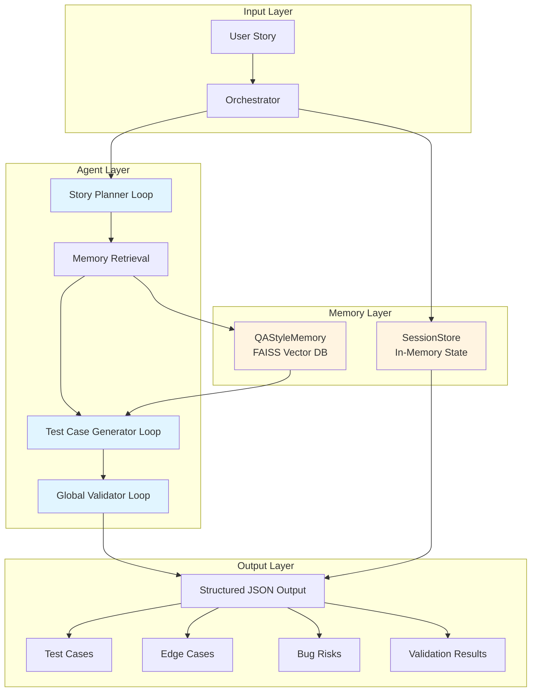

# QA Sentinel: Autonomous Multi-Agent QA System

**Enterprise-grade autonomous QA design system leveraging Google ADK v1, Gemini 2.0 Flash, and memory-augmented reasoning to automate test case generation from user stories.**

---

## Executive Summary

QA Sentinel is a production-ready multi-agent system that automates the complete QA design workflow from user story analysis to validated test case generation. The system employs three specialized agents—Story Planner, Test Case Generator, and Global Validator—orchestrated through Google ADK v1's Loop pattern, enabling autonomous, context-aware test case creation with enterprise-grade validation.

The architecture integrates long-term memory via FAISS vector similarity search, allowing the system to learn from historical QA patterns and maintain consistency across sessions. Each agent operates as an independent Loop with self-correction capabilities, while the orchestrator manages state, memory retrieval, and cross-agent validation. The system outputs structured JSON with test cases, edge cases, bug risk assessments, and validation results, ready for integration into CI/CD pipelines.

Built on Google ADK v1, the system demonstrates advanced agentic AI patterns including validate-refine loops, agent-to-agent evaluation, and memory-augmented reasoning. The implementation is cloud-ready with Docker support and follows production best practices for observability, error handling, and security.

---

## Key Features

- **Autonomous Story Analysis**: Breaks down user stories into structured features, scenarios, and acceptance criteria mappings
- **Hybrid Test Case Generation**: Produces Given/When/Then format test cases with preconditions, steps, and expected results
- **Edge Case & Bug Risk Detection**: Identifies boundary conditions, security vulnerabilities, and potential failure modes
- **Cross-Agent Validation**: Enterprise-grade critic ensuring consistency, completeness, and quality across all agent outputs
- **Memory-Augmented Reasoning**: FAISS-based vector similarity search for pattern learning and style consistency
- **MCP Integration**: Model Context Protocol tools for Markdown and JSON export
- **ADK v1 Compatible**: Fully migrated to Google ADK v1 Loop pattern with compatibility layer
- **Production-Ready**: Comprehensive logging, tracing, error handling, and Cloud Run deployment support

---

## Architecture



---

## Agent Breakdown

### Story Planner Loop

**Purpose**: Decomposes user stories into structured planning artifacts.

**Input**: User story (title, description, acceptance criteria, QA context)

**Output**: JSON containing:
- `features`: 3-8 high-level feature categories
- `scenarios`: Auto-incremented scenarios (SC-1, SC-2, ...) mapped to acceptance criteria
- `notes`: Domain insights, constraints, and testing considerations
- `acceptance_criteria_input`: Original acceptance criteria for traceability

**Implementation**: ADK v1 Loop pattern using `ctx.llm.complete()` with Gemini 2.0 Flash. Includes automatic JSON parsing with markdown code block stripping.

### Test Case Generator Loop

**Purpose**: Transforms planner scenarios into executable test cases.

**Input**: Planner output, QA context, similar examples from memory

**Output**: JSON containing:
- `test_cases`: 1-3 test cases per scenario with Given/When/Then steps
- `edge_cases`: Boundary condition test scenarios (EC-1, EC-2, ...)
- `bug_risks`: Potential failure modes and security concerns (BR-1, BR-2, ...)
- `planner_output`: Original planner output for validation

**Implementation**: Hybrid QA format with Gherkin-style steps. Each test case includes preconditions, actionable steps, and specific expected results. Uses memory-retrieved examples to maintain style consistency.

### Global Validator Loop

**Purpose**: Enterprise-grade validation ensuring cross-agent consistency and quality.

**Input**: Planner output, test case output, QA context

**Output**: JSON validation result:
- `valid`: Boolean indicating overall pipeline validity
- `errors`: Critical issues requiring correction
- `warnings`: Non-blocking quality concerns

**Validation Rules**:
1. Coverage Completeness: Every scenario maps to ≥1 test case
2. Step Quality: All test cases have clear Given/When/Then steps
3. Expected Result Quality: Results are specific and testable
4. Duplicate Detection: No redundant test cases
5. Edge Case Alignment: Edge cases are meaningful and related
6. Consistency: Titles, IDs, and flows match across agents
7. QA Context Alignment: Test cases reflect QA preferences

---

## Memory & Session Layer

### QAStyleMemory

FAISS-based vector database storing historical QA patterns. Uses semantic similarity search to retrieve relevant examples during test case generation, enabling style consistency and pattern learning. Stores story metadata, planner outputs, test case outputs, and QA context for future reference.

### SessionStore

In-memory session management tracking per-session state across the pipeline. Maintains planner outputs, test case outputs, and validation results for each session ID, enabling stateful orchestration and result aggregation.

---

## Evaluation Layer

### ConsistencyEvaluator

Rule-based evaluator analyzing test case coverage, step quality, and structural completeness. Validates that all acceptance criteria are addressed and test cases follow specified formats.

### A2AEvaluator

Agent-to-agent meta-evaluator performing deterministic analysis of cross-agent consistency. Validates that planner scenarios align with generated test cases and that validation results accurately reflect pipeline quality.

---

## Orchestrator Flow

The `QASentinelOrchestrator` coordinates the complete pipeline:

1. **Session Initialization**: Creates session in SessionStore with story metadata
2. **Story Planning**: Invokes StoryPlannerLoop via `loop.Runner`, extracts JSON output
3. **Memory Retrieval**: Queries QAStyleMemory for top-k similar examples using vector similarity
4. **Test Case Generation**: Invokes TestCaseGeneratorLoop with planner output and similar examples
5. **Global Validation**: Invokes GlobalValidatorLoop with planner and test case outputs
6. **Memory Persistence**: Saves complete pipeline output to QAStyleMemory for future learning
7. **Result Aggregation**: Returns consolidated JSON with all outputs

Each stage includes robust error handling, JSON extraction with markdown stripping, and session state management.

---

## Tech Stack

| Component | Technology | Version |
|-----------|-----------|---------|
| **Agent Framework** | Google ADK | v1.19.0 |
| **LLM** | Gemini 2.0 Flash | Latest |
| **Vector Database** | FAISS | CPU variant |
| **Protocol** | Model Context Protocol | Latest |
| **API Framework** | FastAPI + Uvicorn | Latest |
| **Language** | Python | 3.9+ |
| **Environment** | python-dotenv | Latest |

---

## How to Run

### Prerequisites

- Python 3.9 or higher
- Google API Key ([Obtain here](https://ai.google.dev/))

### Installation Steps

1. **Clone Repository**
   ```bash
   git clone https://github.com/MhussainD4772/Capstone-Project-Agentic-AI-.git
   cd Capstone-Project-Agentic-AI-/qa-sentinel
   ```

2. **Create Virtual Environment**
   ```bash
   python3 -m venv venv
   source venv/bin/activate  # Windows: venv\Scripts\activate
   ```

3. **Install Dependencies**
   ```bash
   pip install -r requirements.txt
   ```

4. **Configure API Key**
   
   Create `.env` file:
   ```bash
   echo "GOOGLE_API_KEY=your_api_key_here" > .env
   ```

5. **Execute Pipeline**
   ```bash
   python main.py
   ```

### Expected Execution Flow

```
Running QA Sentinel pipeline...
Session ID: session-demo-1
Title: User updates profile information

[Story Planner Loop executing...]
[Test Case Generator Loop executing...]
[Global Validator Loop executing...]

================================================================================
Pipeline Results:
================================================================================
{ ... structured JSON output ... }
```

---

## Folder Structure

```
qa-sentinel/
│
├── agents/
│   ├── adk_v1_compat.py              # ADK v1 compatibility layer
│   ├── story_planner_agent.py         # Story planning loop
│   ├── testcase_generator_agent.py    # Test case generation loop
│   ├── global_validator_agent.py      # Global validation loop
│   ├── orchestrator_agent.py          # Pipeline orchestrator
│   ├── automation_scaffold_agent.py  # Automation scaffold (future)
│   ├── qa_eval_agent.py              # QA evaluation agent
│   └── qa_validator_agent.py          # QA validation agent
│
├── config/
│   ├── model_config.py                # Model configuration
│   └── settings.py                    # Application settings
│
├── deployment/
│   ├── Dockerfile                     # Container configuration
│   ├── cloudrun_deploy.md             # Cloud Run deployment guide
│   └── agent_engine_setup.md         # Agent Engine setup
│
├── evaluation/
│   ├── consistency_evaluator.py       # Rule-based evaluation
│   ├── a2a_evaluator.py              # Agent-to-agent evaluation
│   ├── eval_runner.py                 # Evaluation runner
│   └── golden_stories.py              # Golden test stories
│
├── examples/
│   ├── sample_input_story.md          # Example input story
│   └── sample_output_tests.md         # Example output
│
├── memory/
│   ├── qa_style_memory.py             # FAISS-based memory store
│   └── session_store.py               # Session state management
│
├── observability/
│   ├── logging_config.py              # Logging configuration
│   └── tracing.py                     # Performance tracing
│
├── tools/
│   ├── file_export_mcp.py             # MCP export tools
│   ├── mcp_file_writer_tool.py        # MCP file writer
│   ├── mcp_directory_reader_tool.py   # MCP directory reader
│   ├── mcp_code_runner_tool.py        # MCP code runner
│   ├── code_execution_tool.py         # Code execution tool
│   └── schema_validator.py            # Schema validation
│
├── main.py                             # Entry point
├── requirements.txt                   # Python dependencies
├── .env                               # Environment variables (gitignored)
├── .gitignore                         # Git ignore rules
└── README.md                          # This document
```

---

## Example Output

### Story Planner Output

```json
{
  "features": [
    "Profile Update - Name",
    "Profile Update - Email",
    "Profile Update - Form Validation"
  ],
  "scenarios": [
    {
      "scenario_id": "SC-1",
      "title": "Update Name Successfully",
      "acceptance_criteria": "User can update their name",
      "tags": ["positive", "name"]
    },
    {
      "scenario_id": "SC-2",
      "title": "Invalid Email Format",
      "acceptance_criteria": "User receives validation error for invalid email format",
      "tags": ["negative", "email", "validation"]
    }
  ],
  "notes": [
    "Consider localization for name field",
    "Verify email uniqueness if applicable"
  ],
  "acceptance_criteria_input": [
    "User can update their name",
    "User can update their email",
    "User receives validation error for invalid email format"
  ]
}
```

### Test Case Generator Output

```json
{
  "test_cases": [
    {
      "id": "TC-1",
      "title": "Verify Successful Name Update - SC-1",
      "preconditions": ["User is logged in"],
      "steps": [
        "Given the user is on the profile page",
        "When the user updates their first name to 'John'",
        "And the user clicks the 'Save' button",
        "Then the profile page should display 'John' as the updated name"
      ],
      "expected_result": "User's name is successfully updated and displayed on the profile page."
    }
  ],
  "edge_cases": [
    {
      "id": "EC-1",
      "description": "Test updating profile with extremely long names. Check for field length limitations."
    }
  ],
  "bug_risks": [
    {
      "id": "BR-1",
      "description": "XSS vulnerability in name or email fields could lead to malicious script injection."
    }
  ]
}
```

### Global Validator Output

```json
{
  "valid": true,
  "errors": [],
  "warnings": []
}
```

---

## Future Improvements

1. **Automated Test Execution**: Integration with test automation frameworks (Selenium, Playwright) to execute generated test cases
2. **Multi-Model Ensemble**: Leverage multiple LLMs for validation and cross-checking to improve accuracy
3. **Real-Time Collaboration**: WebSocket-based interface for collaborative QA story refinement
4. **Advanced Memory Strategies**: Implement RAG (Retrieval-Augmented Generation) with document chunking for larger context windows
5. **Performance Optimization**: Caching layer for frequently accessed patterns and batch processing for multiple stories

---

## License

MIT License. See LICENSE file for details.

---

## Repository

**GitHub**: https://github.com/MhussainD4772/Capstone-Project-Agentic-AI-

---

<div align="center">

**Built with Google ADK v1, Gemini 2.0 Flash, and Python**

</div>
