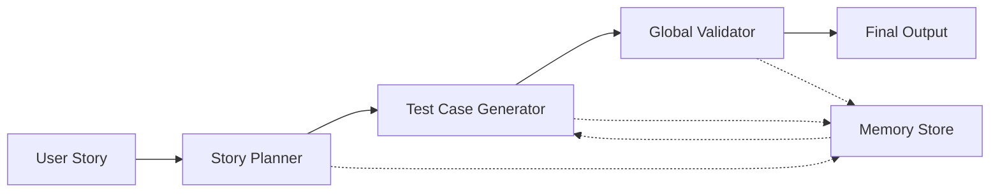

<div align="center">

# 🛡️ QA Sentinel

### **Autonomous Multi-Agent QA System**

[](https://www.python.org/)
[](https://github.com/google/generative-ai-python)
[](https://ai.google.dev/)
[](LICENSE)

**Enterprise-grade multi-agent system that automates the entire QA design workflow**

[Features](#-features) • [Quick Start](#-quick-start) • [Architecture](#-architecture) • [Documentation](#-documentation)

---

</div>

## 🎉 Recent Updates & Status

### **✅ ADK v1 Migration Complete**

The entire system has been successfully migrated to **Google ADK v1** with full compatibility:

- ✅ **All agents converted** to `loop.Loop` pattern (ADK v1 standard)
- ✅ **Compatibility layer** created (`adk_v1_compat.py`) for seamless integration
- ✅ **Event handling** fixed with proper `author` field requirement
- ✅ **JSON parsing** enhanced with automatic markdown code block stripping
- ✅ **Model updated** to `gemini-2.0-flash` for better quota availability
- ✅ **API key security** implemented with `.env` and `.gitignore` protection

### **🚀 Pipeline Status: Fully Operational**

The QA Sentinel pipeline is **running end-to-end successfully**:

| Component | Status | Description |
|-----------|--------|-------------|
| **Story Planner Loop** | ✅ Working | Generates features, scenarios, and notes |
| **Test Case Generator Loop** | ✅ Working | Creates test cases, edge cases, and bug risks |
| **Global Validator Loop** | ✅ Working | Validates pipeline (valid: true, no errors) |
| **Orchestrator** | ✅ Working | Coordinates all agents seamlessly |
| **Memory System** | ✅ Working | Stores and retrieves QA patterns |
| **JSON Parsing** | ✅ Working | Handles LLM responses with markdown stripping |

### **🔧 Key Fixes Applied**

1. **Markdown Code Block Stripping** - Automatically removes ```json wrappers from LLM responses
2. **Event Creation** - Added required `author` field for ADK Event objects
3. **Model Selection** - Switched to `gemini-2.0-flash` for optimal quota usage
4. **Session Management** - Proper session creation before agent execution
5. **Error Handling** - Robust JSON parsing with fallback error messages

---

## ✨ Features

<div align="center">

| 🎯 **Planning** | 🧪 **Test Generation** | ✅ **Validation** | 🧠 **Memory** |
|:---:|:---:|:---:|:---:|
| User story breakdown | Hybrid test cases | Cross-agent validation | Long-term pattern learning |
| Scenario extraction | Edge case analysis | Quality assurance | Style memory |

</div>

### 🚀 Core Capabilities

- ✅ **User Story Planning** - Breaks down stories into features, scenarios, and acceptance criteria
- ✅ **Test Case Generation** - Creates hybrid manual test cases with Given/When/Then format
- ✅ **Edge Case & Bug Risk Analysis** - Identifies potential issues and boundary conditions
- ✅ **Global Validation** - Enterprise-grade critic ensuring cross-agent consistency
- ✅ **Memory-Augmented Refinement** - Learns from past patterns and QA styles
- ✅ **MCP Export Tools** - Export results as Markdown or JSON via Model Context Protocol

---

## 🏗️ Architecture

### **Built with Modern AI Stack**

```
┌─────────────────────────────────────────────────────────────┐
│                    QA Sentinel Pipeline                      │
├─────────────────────────────────────────────────────────────┤
│                                                              │
│  ┌──────────────┐    ┌──────────────┐    ┌──────────────┐  │
│  │   Story      │───▶│   Test Case  │───▶│   Global    │  │
│  │   Planner    │    │   Generator  │    │  Validator   │  │
│  └──────────────┘    └──────────────┘    └──────────────┘  │
│         │                   │                    │           │
│         └───────────────────┴────────────────────┘           │
│                            │                                  │
│                    ┌───────▼───────┐                         │
│                    │  Orchestrator  │                         │
│                    └───────┬───────┘                         │
│                            │                                  │
│         ┌──────────────────┴──────────────────┐            │
│         │                                       │            │
│  ┌──────▼──────┐                      ┌───────▼──────┐     │
│  │   Memory    │                      │   Session    │     │
│  │   Store     │                      │   Store      │     │
│  └─────────────┘                      └──────────────┘     │
│                                                              │
└─────────────────────────────────────────────────────────────┘
```

### **Technology Stack**

| Component | Technology |
|-----------|-----------|
| **Agent Framework** | Google ADK v1 (Agent Development Kit) |
| **LLM** | Gemini 2.0 Flash |
| **Memory** | FAISS (Vector Similarity Search) |
| **Protocol** | Model Context Protocol (MCP) |
| **API Framework** | FastAPI + Uvicorn |
| **Language** | Python 3.9+ |

---

## 🚀 Quick Start

### **Prerequisites**

- Python 3.9 or higher
- Google API Key ([Get one here](https://ai.google.dev/))

### **Installation**

1. **Clone the repository**
   ```bash
   git clone <your-repo-url>
   cd qa-sentinel
   ```

2. **Create virtual environment**
   ```bash
   python3 -m venv venv
   source venv/bin/activate  # On Windows: venv\Scripts\activate
   ```

3. **Install dependencies**
   ```bash
   pip install -r requirements.txt
   ```

4. **Configure API Key**
   
   Create a `.env` file in the project root:
   ```bash
   echo "GOOGLE_API_KEY=your_api_key_here" > .env
   ```
   
   ⚠️ **Note**: The `.env` file is already in `.gitignore` to protect your API key.

5. **Run the pipeline**
   ```bash
   python main.py
   ```

### **Expected Output**

```
Running QA Sentinel pipeline...
Session ID: session-demo-1
Title: User updates profile information

================================================================================
Pipeline Results:
================================================================================
{
  "session_id": "session-demo-1",
  "planner_output": { ... },
  "testcase_output": { ... },
  "global_validation_output": { ... }
}
```

---

## 📂 Project Structure

```
qa-sentinel/
│
├── 🤖 agents/
│   ├── story_planner_agent.py          # Story planning loop (ADK v1)
│   ├── testcase_generator_agent.py     # Test case generation loop
│   ├── global_validator_agent.py       # Global validation loop
│   ├── orchestrator_agent.py           # Pipeline orchestrator
│   └── adk_v1_compat.py                # ADK v1 compatibility layer
│
├── 🛠️ tools/
│   ├── file_export_mcp.py              # MCP export tools
│   ├── mcp_file_writer_tool.py
│   ├── mcp_directory_reader_tool.py
│   └── mcp_code_runner_tool.py
│
├── 🧠 memory/
│   ├── qa_style_memory.py              # Long-term QA pattern memory
│   └── session_store.py                # Session state management
│
├── 📊 observability/
│   ├── logging_config.py               # Logging configuration
│   └── tracing.py                      # Performance tracing
│
├── 📈 evaluation/
│   ├── consistency_evaluator.py        # Rule-based evaluation
│   ├── a2a_evaluator.py                # Agent-to-agent evaluation
│   └── eval_runner.py                  # Evaluation runner
│
├── ⚙️ config/
│   ├── settings.py                     # Application settings
│   └── model_config.py                 # Model configuration
│
├── 📝 examples/
│   ├── sample_input_story.md           # Example input
│   └── sample_output_tests.md          # Example output
│
├── 🚀 deployment/
│   ├── Dockerfile                      # Container configuration
│   ├── cloudrun_deploy.md              # Cloud Run deployment guide
│   └── agent_engine_setup.md           # Agent Engine setup
│
├── main.py                             # Entry point
├── requirements.txt                    # Python dependencies
├── .env                                # Environment variables (gitignored)
└── README.md                           # This file
```

---

## 🧠 Architecture Details

### **1. Agents Layer (ADK v1 Compatible)**

All agents use the **Google ADK v1 Loop pattern**:

| Agent | Pattern | Description |
|-------|---------|-------------|
| `StoryPlannerLoop` | `loop.Loop` | Breaks stories into features, scenarios, notes |
| `TestCaseGeneratorLoop` | `loop.Loop` | Generates hybrid manual test cases (Given/When/Then) |
| `GlobalValidatorLoop` | `loop.Loop` | Enterprise-grade critic ensuring cross-agent consistency |

**Key Features:**
- ✅ ADK v1 compatible (`loop.Loop` interface)
- ✅ Automatic JSON parsing with markdown code block stripping
- ✅ Error handling and retry logic
- ✅ Context-aware LLM calls via `ctx.llm.complete()`

### **2. Memory Layer**

| Component | Technology | Purpose |
|-----------|-----------|---------|
| `QAStyleMemory` | FAISS + Vector DB | Long-term memory of story patterns & QA style |
| `SessionStore` | In-memory store | Tracks per-session outputs |

### **3. Orchestrator Layer**

`QASentinelOrchestrator` coordinates:
- ✅ Session management with `InMemorySessionService`
- ✅ Memory retrieval for similar examples
- ✅ Agent invocation via `loop.Runner`
- ✅ Final aggregation of outputs
- ✅ Error handling and JSON extraction
- ✅ Saving results back into memory

### **4. Tools (MCP)**

| Tool | Purpose |
|------|---------|
| `save_markdown` | Export planner/testcase results as Markdown |
| `save_json` | Export structured pipeline outputs |

---

## 🔧 Configuration

### **Environment Variables**

Create a `.env` file:

```env
GOOGLE_API_KEY=your_google_api_key_here
```

### **Model Configuration**

Default model: `gemini-2.0-flash`

To change the model, update the `model` parameter in:
- `agents/story_planner_agent.py`
- `agents/testcase_generator_agent.py`
- `agents/global_validator_agent.py`

---

## 📊 Example Workflow



### **Input Example**

```json
{
  "title": "User updates profile information",
  "description": "As a user, I want to update my profile...",
  "acceptance_criteria": [
    "User can update their name",
    "User can update their email",
    "User receives validation error for invalid email format"
  ],
  "qa_context": "Focus on negative testing, usability, and boundary behavior."
}
```

### **Output Structure**

```json
{
  "session_id": "session-demo-1",
  "planner_output": {
    "features": [...],
    "scenarios": [...],
    "notes": [...]
  },
  "testcase_output": {
    "test_cases": [...],
    "edge_cases": [...],
    "bug_risks": [...]
  },
  "global_validation_output": {
    "valid": true,
    "errors": [],
    "warnings": []
  }
}
```

---

## 🧪 Running Tests

```bash
# Run the main pipeline
python main.py

# Run MCP tool server
python tools/file_export_mcp.py
```

---

## 🚀 Deployment

### **Cloud Run Deployment**

See detailed instructions in:
- [`deployment/cloudrun_deploy.md`](deployment/cloudrun_deploy.md)
- [`deployment/agent_engine_setup.md`](deployment/agent_engine_setup.md)

### **Docker**

```bash
docker build -t qa-sentinel -f deployment/Dockerfile .
docker run -e GOOGLE_API_KEY=your_key qa-sentinel
```

---

## 🏆 Key Features & Deliverables

- ✅ **Multi-Agent Design** - Three specialized agents working in harmony
- ✅ **ADK v1 Compatible** - Fully converted to Google ADK v1 Loop pattern
- ✅ **Validate-Refine Loops** - Self-correcting agent behavior
- ✅ **A2A Evaluation** - Agent-to-agent meta-evaluation
- ✅ **Observability Layer** - Comprehensive logging and tracing
- ✅ **Memory-Augmented Reasoning** - Learns from past patterns
- ✅ **MCP Export Tools** - Model Context Protocol integration
- ✅ **Cloud-Ready Architecture** - Ready for Cloud Run deployment

---

## 🔒 Security

- ✅ API keys stored in `.env` (gitignored)
- ✅ No hardcoded credentials
- ✅ Environment-based configuration
- ✅ Secure session management

---

## 📝 License

MIT License - see [LICENSE](LICENSE) file for details.

---

## 🤝 Contributing

Contributions are welcome! Please feel free to submit a Pull Request.

---

## 📧 Contact

For questions or issues, please open an issue on GitHub.

---

<div align="center">

**Built with ❤️ using Google ADK, Gemini, and Python**

⭐ **Star this repo if you find it useful!** ⭐

</div>
